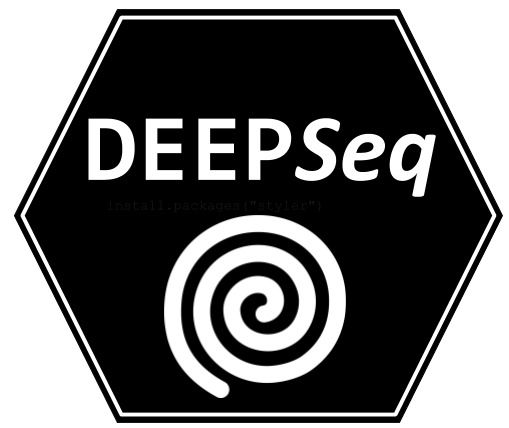

A Minimal Deep Learning Framework for Analysis of Text Sequences in Network Security 
======================================================

A set of R scripts for using [Keras](https://keras.rstudio.com) and tf for detecting patterns in text sequences and perform a binary classifcation. The `deepseq_classifier.R` script is the main part of the framework. It is possible to invoke the scripts with several parameters to perform tuning, oversampling, and test a model on a different file other than the one used for training.

The dataset format
------------------

Usually, the script accept a CSV file with just two colummn: the text sequence and the class. In this repo two datasets for detecting Botnet based on the [stratosphereIPS](http://stratosphereips.org) behavioral models are available. Namely, the `ctu13subs.csv` and the `ctu19subs.csv`.

    State,class,label
    1,00R.A.A.A.A,1
    1,00000000,1
    2451z.z.z.z.z.,0

In addition, there is one dataset for DGA detection  `argencon.csv.gz`. 

    domain, class, label
    www.com,1,dga.bambenek
    www.google.com,0,normal.alexa
    

Setup the framework
----------------------
The basic setup is done through the `config.R` file. There it is possible to setup the directories where datasets are located as well as the directory where output models and results will be stored.

Finally, the `valid_characters` (AKA the vocabulary) used by the `tokenize()`  function should be included. By default, the example `config.R` file includes the vocabulary used in the Stratosphere IPS Botnet and DGA detection problems.
    
Invoking the framework
----------------------

The script accepts serveral options.

    bash$ Rscript --help
            
            --generate
                    Generate train and test files

            --experimenttag=EXPERIMENTTAG
                    Set experiment tag id

            --modelid=MODELID
                    Select between different models

            --list-available-models
                    List different models

            --tune
                    Tune the selected model

            --testonly
                    Bypass training and test with previous weights

            --maxlen=MAXLEN
                    Set the maximun length of the domain name considered

            --modelfile=MODELFILE
                    A file to load model from

            --testfile=TESTFILE
                    A file to load test data from

            --datafile=DATAFILE
                    A file to load dataset from

            --upsample
                    Apply oversampling to  train dataset

For a basic invokation of the the script you need to include `--datafile`, and `--modelid`. However, if it is the first time using a given `datafile`, you will need include the `--generate` option. The generate option save the tokenized version of the sequence. Below there is an example for using the `ctu13subs.csv` data file and the `modelid` number 3.

    bash$ Rscript deepseq_classifier.R --datafile=dataset/ctu13subs.csv --generate -- modelid=3

The number 3 corresponds to the implementation of the LSTM network used in the [Woodbridge](https://arxiv.org/abs/1611.00791) article. You can list all the available models using the `--list-available-models` parameter. The results of running the model 3 will be found in directory `results/`. By default you should look at the .csv files with the `default-experiment` name. You can optionally set up a different name using the `--experimenttag` parameter.

    bash$ Rscript deepseq_classifier.R --datafile=dataset/ctu13subs.csv --generate -- modelid=3 --experimenttag=test-experiment-1

The maximun lenght of the sequence is set by default to 45 characters. However it is possible to change that using the `--maxlen` parameter.

You can implement your own models following the template below: First you need to create a new file with a name such as `model_default_keras.R`. Then you should include to lists. The first one is used for parameter tuning and the second is used as default parameters.

    # Set the parameters to use when tunning
    default_keras_model_parameters_tune=list(
      lstm_size = c(128,64,32),
      embedingdim = c(128,50,32),
      dropout = c(0.5)
    )

    # Set the default parameters
    default_keras_model_parameters=list(
      embedingdim = 128,
      lstm_size = 128,
      dropout = 0.5
    )

Then you create your model using the parameters. This is basically any Keras valid model.

    keras_model<-function(x,parameters=default_keras_model_parameters){
      
      input_shape <- dim(x)[2]
      inputs<-layer_input(shape = input_shape) 
      
      embeding<- inputs %>% layer_embedding(length(valid_characters_vector), parameters$embedingdim , input_length = input_shape,mask_zero=T)
      
      lstm <- embeding %>%
       layer_lstm(units = parameters$lstm_size) %>%
      
        layer_dropout(rate = parameters$dropout) %>%
        layer_dense(1, activation = 'sigmoid')
      
      #compile model
      model_endgame_bidirectional <- keras_model(inputs = inputs, outputs = lstm)
      model_endgame_bidirectional %>% compile(
        optimizer = 'rmsprop',
        loss = 'binary_crossentropy',
        metrics = c('accuracy')
      )
      summary(model_endgame_bidirectional)
      return(model_endgame_bidirectional)
    }

The last two steps area to add the new model to the list of models and source the the `model_default_keras.R` file in `build_model.R`.

    funcs[["default model"]]=keras_model

## References

[1] P. Torres, C. Catania, S. Garcia and C. G. Garino, "An analysis of Recurrent Neural Networks for Botnet detection behavior," 2016 IEEE Biennial Congress of Argentina (ARGENCON), Buenos Aires, Argentina, 2016, pp. 1-6, doi: 10.1109/ARGENCON.2016.7585247.

[2] Catania C., García S., Torres P. (2019) Deep Convolutional Neural Networks for DGA Detection. In: Pesado P., Aciti C. (eds) Computer Science – CACIC 2018. CACIC 2018. Communications in Computer and Information Science, vol 995. Springer, Cham.

[3] Palau, Franco, et al. "Detecting DNS Threats: A Deep Learning Model to Rule Them All." XX Simposio Argentino de Inteligencia Artificial (ASAI 2019)-JAIIO 48 (Salta). 2019.

[4] Palau, Franco, et al. "DNS Tunneling: A Deep Learning based Lexicographical Detection Approach." arXiv preprint arXiv:2006.06122 (2020)

 ## Afiliation and support
* LABSIN (http://labsin.org)

* The work was supported by UNCuyo University, School of Engineering. (http://ingenieria.uncuyo.edu.ar)

 ## Acknowledgements 
 
 Thanks to NVIDIA Corporation GPU GRANT 2019 for the Titan V used for developing and testing.
 
